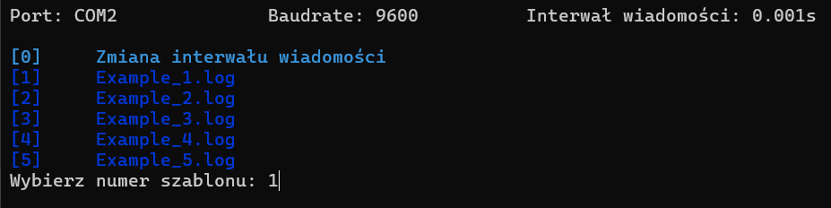
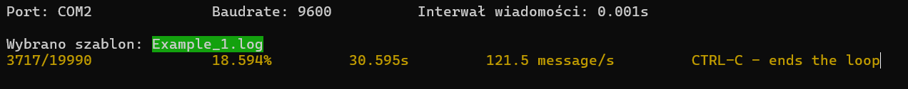
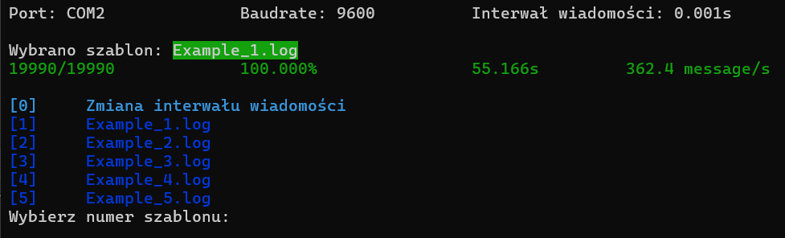

# KregleLive_3_FakeLaneSim

KregleLive_3_FakeLaneSim is a console tool designed to test the [KregleLive_3_Server](https://github.com/patlukas/KregleLive_3_Server) and [KregleLive_3_Client](https://github.com/patlukas/KregleLive_3_Client) applications. The application simulates a bowling alley environment during competitions, sending relevant data to **KregleLive_3_Server**, which then processes it and forwards the information to **KregleLive_3_Client**.

---

## 📌 How does KregleLive_3_FakeLaneSim work?

1. The user first selects a `.log` file from the `templates/` folder.
2. The application reads data from the selected file.
3. It sends the data through a COM port.

---

## 🚀 How to run?

### 🐍 Running with Python

1. It is recommended to use **Python 3.12** and `pip 23.2.1`, but they are not required.
2. Clone the repository:
   ```bash
   git clone https://github.com/patlukas/KregleLive_3_FakeLaneSim
   cd KregleLive_3_FakeLaneSim
   ```
3. Install dependencies:
   ```bash
   pip install -r requirements.txt
   ```
4. Run the application:
   ```bash
   python main.py
   ```

### 🖥 Running from an .exe file
If you don't want to install Python, you can download the **generated `.exe` file** from the [Releases](https://github.com/patlukas/KregleLive_3_FakeLaneSim/releases) section and run it directly.

---

## 🛠 Configuration and Simulation Expansion

To add new simulation scenarios:
1. Place a new `.log` file in the `templates/` directory.
2. Select the appropriate file for simulation when running the application.

---

## 📷 Screenshots

Menu to select options:


Program during simulation:


Program after simulation:

---
